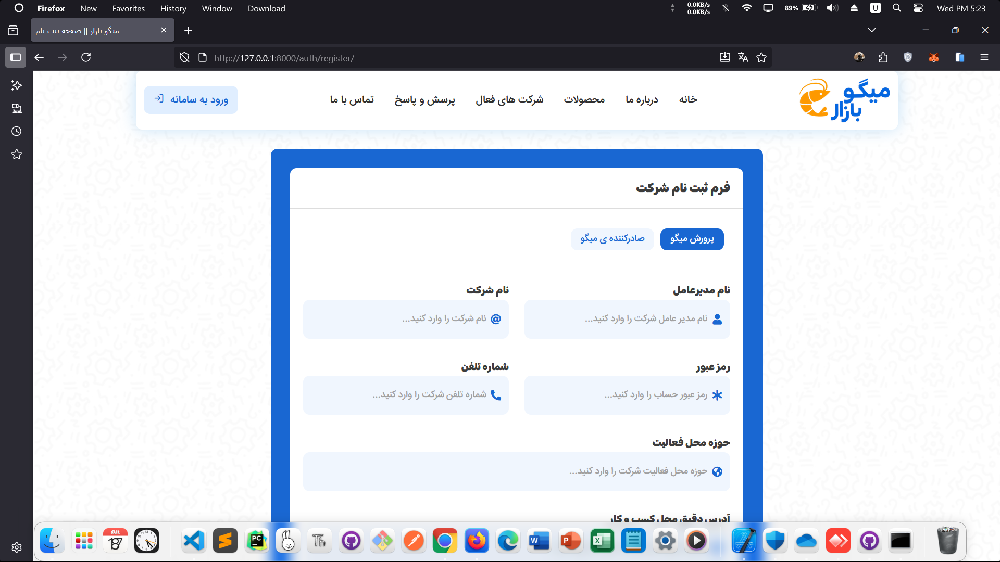

<div align="center" style="margin-bottom: 20px;"> <a href="https://github.com/AmirHosseinGholami-DEV/Shrimp-Shop-System/" target="_blank" style="text-decoration: none; color: inherit;">  <h3>Shrimp Shop System</h3> </a> </div>

## Installation

Follow these steps to set up the project on your local machine:

### 1. Clone the Repository
```bash
git clone https://github.com/AmirHosseinGholami-DEV/Shrimp-Shop-System.git
cd Shrimp-Shop-System.
```
### 2. Set Up a Virtual Environment
```bash
python -m venv venv
source venv/bin/activate  # On Windows, use `venv\Scripts\activate`
```
### 3. Install Dependencies
```bash
pip install -r requirements.txt
```

### 5. Apply Migrations
```bash
python manage.py migrate
```
### 6. Create a Superuser (Admin)
```bash
python manage.py createsuperuser
```
### 7. Run the Development Server
```bash
python manage.py runserver
```
Visit http://localhost:8000 in your browser to access the application.

---

## Contact

If you have any questions or need assistance, feel free to reach out:

Email: amirhosseingholami1389work@gmail.com
GitHub: https://github.com/AmirHosseinGholami-DEV/
